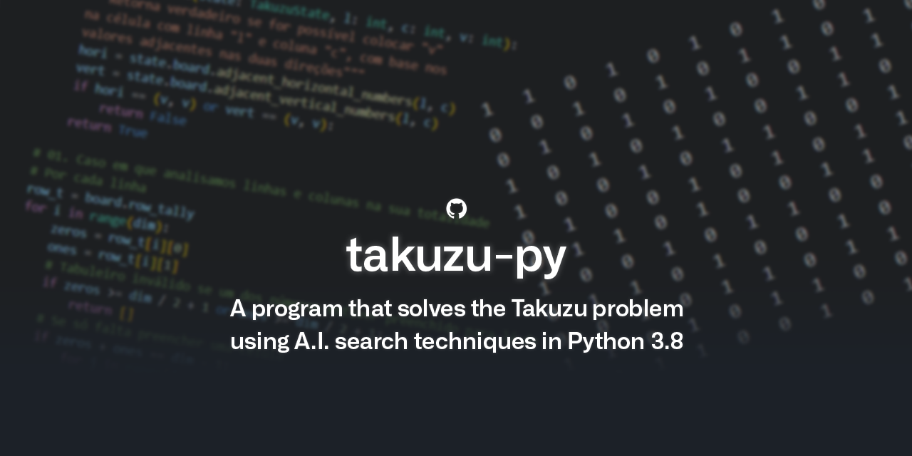

# takuzu-py

IST Artificial Intelligence course's project (LEIC-A 2021/2022). Made by [João Cardoso](https://github.com/joaoncardoso) and [José João Ferreira](https://github.com/jjasferreira).



---

## How to use

To fill the Takuzu board appropriately, the first line of the input file must have the number `N`, where `N` corresponds to the dimension of the `N` × `N` board, followed by the board itself, with both `0`'s and `1`'s representing a certain value and `2`'s signaling empty cells.

> You can check the files in the `tests` folder for reference.

```py
python <path_to_takuzu.py> < <path_to_input_file>
```

### Example

```py
python takuzu.py < tests/t_04_007.in
```

Optionally, if you prefer to save the output to a file, instead of having it being displayed on your terminal.

```py
python takuzu.py < tests/t_04_007.in > tests/t_04_007.result
```

---

## How to run tests with the `test.sh` script

```bash
./test.sh [flags] <path_to_takuzu.py> <path_to_tests>
```

- `-d` flag shows in the terminal the "diff" of expect output with actual output
- `-c` flag removes generated `.result` files (instead of testing)
- `-h` flag (as usual) shows this information

### Example

Navigate to your `misc` folder and type on your terminal:

```bash
./test.sh -d ../takuzu.py ../tests
```

In addition to the tests in this _repo_, you can find more and their expected results [_here_](https://github.com/diogotcorreia/proj-ist-unit-tests/tree/master/ia/2021-2022/custom-tests)

---

## Formatting

We made the final report using [Obsidian](https://obsidian.md/).

In order to keep consistency in this project, we use [`black`](https://github.com/psf/black) as a code formatter for Python files.

Alternatively, for the Markdown ones, we use [`prettier`](https://github.com/prettier/prettier).
